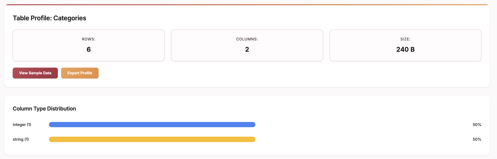

<h3>SQLite EDA</h3>

A powerful command-line tool for Exploratory Data Analysis of SQLite databases with interactive web-based visualizations.

<h4>Features</h4>

🔍 Interactive Data Exploration - Browse tables, examine schemas, and query data through a clean web interface

📊 Dynamic Visualizations - Generate charts and graphs using D3.js for immediate visual insights

⚡ Real-time Analysis - Live updates as you explore your data

🌐 Web-based Interface - No desktop app required - works in any modern browser

🚀 Zero Configuration - Just point it at your SQLite file and go

<h3>Installation</h3>

<h4>Global Installation (Recommended)</h4>
<pre><code>npm install -g sqlite-eda</code></pre>

<h4>Local Installation</h4>
<pre><code>npm install sqlite-eda</code></pre>

<h3>Quick Start</h3>
<pre><code># Analyze any SQLite database
sqlite-eda your-database.sqlite</code></pre>

The tool will automatically open your browser to the analysis interface
<b>Default: http://localhost:3000 . Resolves all port conflicts dynamically.</b>

<h4>Usage Examples</h4>
bash# Basic usage
sqlite-eda data.db

# Specify a custom port
sqlite-eda data.db --port 8080

<h4>What You Can Do</h4>

Explore Tables: View all tables in your database with row counts and schema information
Run Queries: Execute SQL queries directly in the web interface
Visualize Data: Generate histograms, scatter plots, bar charts, and more
Export Results: Download query results as CSV or JSON
Schema Analysis: Understand relationships between tables

<h3>Development</h3>

<h4>Setup</h4>
<ul>
  <li><code>git clone https://github.com/glattoun/sqlite-eda.git</code></li>
  <li><code>cd sqlite-eda</code></li>
  <li><code>npm install</code></li>
</ul>

<h4>Run Locally</h4>
<ul>
  <li><code>npm start path/to/your/database.sqlite</code></li>
</ul>

<h4>Project Structure</h4>
<pre><code>sqlite-eda/
├── src/
│   ├── server.js          # Express server
│   └── public/            # Web interface files
├── bin/
│   └── sqlite-eda.js      # CLI entry point
└── package.json
</code></pre>
<h4>Requirements</h4>

<ul><li>Node.js 14 or higher</li>
<li>A SQLite database file</li></ul>
